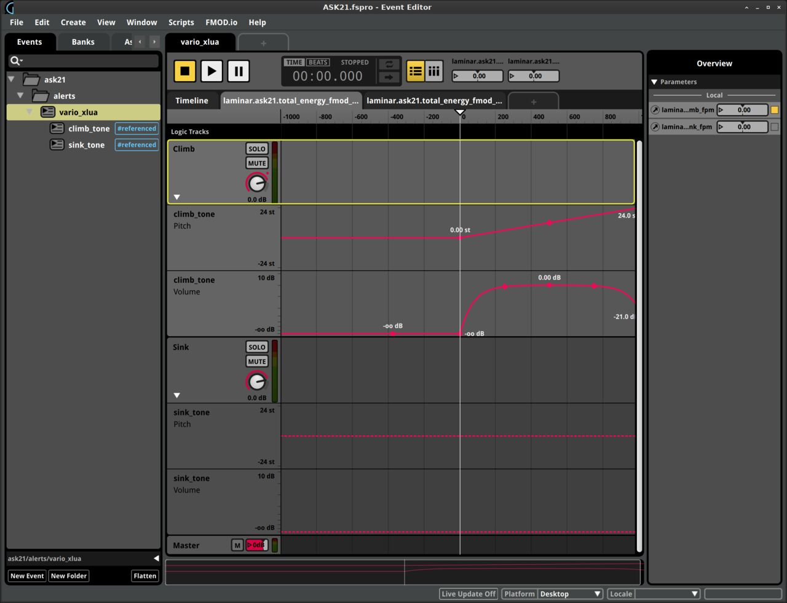

Custom (additional) sound for FMOD
=====

   

In order to **add** _custom_ sounds to [FMOD](https://developer.x-plane.com/article/using-fmod-with-x-plane/)-ed
aircrafts, one needs to (_italic_ relates to FMOD objects/terms, **bold** to X-Plane's and `literal`
to custom resources/settings):

* Make sure to start with **X-Plane Starter Project_**

* Create a `Custom` _Bank_ ("_New Bank_" in the FMOD "_Banks_" tab)

* Create your custom _Event(s)_, e.g. `ask21/alerts/vario_xlua`
  (you MAY use _Folders_ to organize your _Events_)

* Make sure to assign your custom _Event(s)_ to that `Custom` _Bank_
  (in the FMOD "_Banks_" tab or right-clicking on the _Event_ -> "_Assign to Bank_")

* When using (custom) _Parameter(s)_ - e.g. `laminar.ask21.total_energy_fmod_climb_fpm` - make sure to configure them as:
  - _Name_: replace slashes ("/")  with dots (".") in the **Dataref** name
    (do NOT use _Folders_ to organize those _Parameters_)
  - _Type_: "_User: Continuous_"
  - _Scope_: "_Local_" and "_Exposed recursively via event instruments_"
  - _Range_; e.g. `-1000` to `1000` (fpm = feet/minute)

* Make sure to assign your custom _Event(s)_ to the proper _Bus_; e.g. the X-Plane **Interior** _Bus_
  (in the FMOD "_Mixer_" window)

* "_Build_" your project and "_Export its GUIDs_"

* Copy the `Custom.bank` file in the aircraft **fmod** folder ("**fmod/`Custom.bank`**");
  ___Do NOT replace the existing "fmod/Master Bank.bank"!___

* Edit the aircraft ___existing___ "**fmod/__GUIDS.txt__**" and ___add___:
  - the `Custom` _Bank_ GUID;
    e.g. `{3a77f22a-6669-4a4d-ba89-87a0a90cd583} bank:/Custom`
  - the custom `ask21/alerts/vario_xlua` _Event_ GUID;
    e.g. `{2d01cfe5-5d51-4641-a30d-a7cfaa56de16} event:/ask21/alerts/vario_xlua`
  - the custom `laminar.ask21.total_energy_fmod_*_fpm` _Parameters_ GUIDs;
    e.g. `{0106df92-f361-4559-8505-a8d029ae8c6e} parameter:/laminar.ask21.total_energy_fmod_climb_fpm`
    and  `{62a9298b-ec4b-463d-b8c5-59d8d8211a7b} parameter:/laminar.ask21.total_energy_fmod_sink_fpm`

* Edit the aircraft existing "**fmod/ASK21.snd**" file and:
  - ___add___ the `Custom` _Bank_ file requirement: `REQUIRES_BANK Custom.bank`
  - ___replace___ the existing _Event_ with the custom one: `EVENT_NAME /ask21/alerts/vario_xlua`

* Make sure the custom **Dataref(s)** matching the _Parameter(s)_ are created in **xlua plugins/scripts**;
  e.g. in "**plugins/xlua/scripts/ask21_variometer/`ask21_variometer.lua`**":

```
// Create datarefs
total_energy_fmod_climb_fpm = create_dataref("laminar/ask21/total_energy_fmod_climb_fpm","number")
total_energy_fmod_sink_fpm = create_dataref("laminar/ask21/total_energy_fmod_sink_fpm","number")

// Update datarefs
total_energy_fmod_climb_fpm = ...
total_energy_fmod_sink_fpm = ...
```

* When making changes and reloading the aircraft in X-Plane, make sure to **Menu > Developer >
  Reload the Current Aircraft _and Art_**
